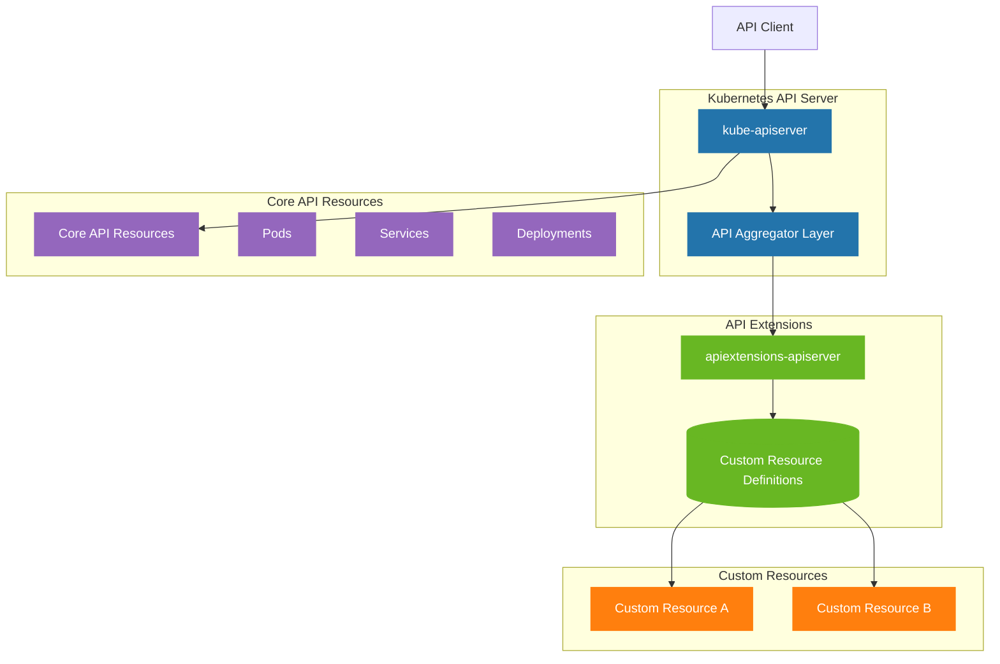
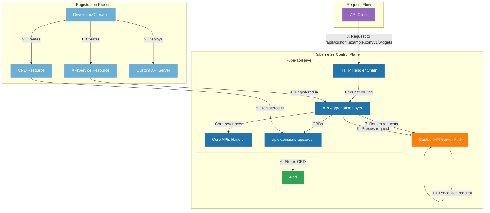
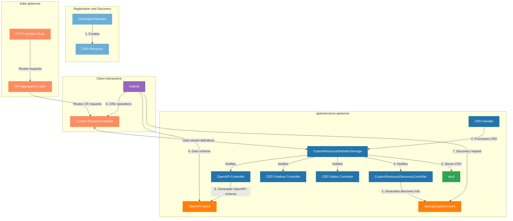

+++
author = "hannibal"
categories = ["kubernetes", "go", "crds"]
date = "2025-05-12T01:01:00+01:00"
title = "In-depth look at CRDs and how they work under the hood"
url = "/2025/05/12/in-depth-look-at-crds-and-how-they-work-under-the-hood"
comments = true
+++

# In-depth look at CRDs and how they work under the hood

Today, we are going to walk through how a CRD looks like, what it does, what it contains, how it works and how it alters Kubernetes.
The design, the api extension and links and snippets to the code ( accurate at the time of writing ) where it happens.

Let's dive in.

## What are CRDs

CRDs as described in the official [Kubernetes Documentation page](https://kubernetes.io/docs/concepts/extend-kubernetes/api-extension/custom-resources/) are objects that can extend the API of Kubernetes.

But what does this actually mean? It means, that it will extend the API with functionality that you, as the author of the CRD provide it with. But the CRD alone is of no real use. It's merrily a vessel for information at that point that Kubernetes objects are not aware of. However, combine it with a custom operator, now you have a fully fledged leg in the Kubernetes ecosystem. That ecosystem 

A custom controller will keep your object at the state you request it in. It will give you a hook into the Kubernetes API. We will see in great detail how it does that. First, let's take a look at how a CRD looks like and what it contains.

Then, we are going to take a look at how the Kubernetes API looks like and how the CRD hooks into that.

### Dissecting a CRD

In Kubernetes every object and the corresponding API has an [Open API v2 and v3 schema](https://kubernetes.io/docs/concepts/overview/kubernetes-api/#openapi-interface-definition). These schemas describe an object and it's properties. Then it's used to serialize the object and put them into ETCD. This is how state and other things are stored. Then, the schema is used to create the object back when it's retrieving the state through the API.

In it's purest form, this is a CRD:

```yaml
apiVersion: apiextensions.k8s.io/v1
kind: CustomResourceDefinition
metadata:
  annotations:
    controller-gen.kubebuilder.io/version: v0.14.0
  name: bootstraps.delivery.crd-bootstrap
spec:
  group: delivery.crd-bootstrap
  names:
    kind: Bootstrap
    listKind: BootstrapList
    plural: bootstraps
    singular: bootstrap
  scope: Namespaced
  versions:
    - name: v1alpha1
      schema:
        openAPIV3Schema:
          description: Bootstrap is the Schema for the bootstraps API.
          properties:
            apiVersion:
              description: |-
                APIVersion defines the versioned schema of this representation of an object.
                Servers should convert recognized schemas to the latest internal value, and
                may reject unrecognized values.
                More info: https://git.k8s.io/community/contributors/devel/sig-architecture/api-conventions.md#resources
              type: string
            kind:
              description: |-
                Kind is a string value representing the REST resource this object represents.
                Servers may infer this from the endpoint the client submits requests to.
                Cannot be updated.
                In CamelCase.
                More info: https://git.k8s.io/community/contributors/devel/sig-architecture/api-conventions.md#types-kinds
              type: string
            metadata:
              type: object
            spec:
              description: BootstrapSpec defines the desired state of Bootstrap.
              properties:
                interval:
                  description: Interval defines the regular interval at which a poll
                    for new version should happen.
                  type: string
              required:
                - interval
              type: object
            status:
              description: BootstrapStatus defines the observed state of Bootstrap.
              properties:
                observedGeneration:
                  description: ObservedGeneration is the last reconciled generation.
                  format: int64
                  type: integer
              type: object
          type: object
      served: true
      storage: true
      subresources:
        status: {}
```

This a simplified version of a CRD. The `openAPIV3Schema` defines what properties this crd will have. Using it, we can actually generate a YAML file that can fullfil this spec. We can also marshal values into an existing struct from arbitrary 
YAML data using this schema. Given this struct:

```go
type BootstrapSpec struct {
	// Interval defines the regular interval at which a poll for new version should happen.
	// +optional
	Interval metav1.Duration `json:"interval,omitempty"`
}

type Bootstrap struct {
	metav1.TypeMeta   `json:",inline"`
	metav1.ObjectMeta `json:"metadata,omitempty"`

	Spec   BootstrapSpec   `json:"spec,omitempty"`
	Status BootstrapStatus `json:"status,omitempty"`
}
```

And a YAML file like this:
```yaml
apiVersion: delivery.crd-bootstrap/v1alpha1
kind: Bootstrap
metadata:
  name: bootstrap-sample
  namespace: crd-bootstrap-system
spec:
  interval: 10s
```

We can call marshal using a marshaller that understands the above schema. Aka. has this type registered. But this isn't fancy, right? Since we have yaml tags so this should just work. Well, yes, however, what else you get using the schema is _validation_! And validation is important. Because that's how you get Type safety. You can use the above schema to validate the data and tell the API that the incoming YAML that I would like to serialize into a []byte value actually isn't good.

For example, this yaml:

```yaml
apiVersion: delivery.crd-bootstrap/v1alpha1
kind: Bootstrap
metadata:
  name: bootstrap-sample
  namespace: crd-bootstrap-system
spec: {}
```

Is not good. It fails validation of the schema because it doesn't have the `interval` under spec. And that is a `required` field. Same goes for a plethora of validation rules from regexes, to values to min, maxes. Schemas are great.

Now, a custom controller can use this schema to create the right typed object during a `Get` operation (whether you're using kubectl or a custom controller it goes this way in both cases).

There is, of course, caching involved in all of this. Heavily. Otherwise, we would be killing the API server with too many requests. I'm sure you, dear reader, encountered many times the api telling you that the request is being throttled.

Let's not including caching here though, for now, because that complicates things massively. Let's assume we have a plain `Get` call to an object. It would look something like this ( in case of a custom controller ):

_Note_: We are going to look at the how the [controller-runtime](https://github.com/kubernetes-sigs/controller-runtime) does all of this and uses client-go to talk to the API. The registration on the Kubernetes side comes after this. For now, let's look at what the runtime is doing.

```go
obj := &MyCustomType{}
if err := r.Get(ctx, client.ObjectKey{Namespace: "my-namespace", Name: "object-name"}, obj); err != nil {
    ...
}
```

Now, ignoring cache, what actually happens is this:

```go
	// Perform a live lookup.
	switch obj.(type) {
	case runtime.Unstructured:
		return c.unstructuredClient.Get(ctx, key, obj, opts...)
	case *metav1.PartialObjectMetadata:
		// Metadata only object should always preserve the GVK coming in from the caller.
		defer c.resetGroupVersionKind(obj, obj.GetObjectKind().GroupVersionKind())
		return c.metadataClient.Get(ctx, key, obj, opts...)
	default:
		return c.typedClient.Get(ctx, key, obj, opts...)
	}
```

We check whether or not we are trying to get an unstructured object ( which is possible if you don't have the struct just want a `map[string]any` ) or a partial object which is useful for caching optimization. Otherwise, we fall back to a typedClient.

This is the entire Get call:

```go
// Get implements client.Client.
func (c *typedClient) Get(ctx context.Context, key ObjectKey, obj Object, opts ...GetOption) error {
	r, err := c.resources.getResource(obj)
	if err != nil {
		return err
	}
	getOpts := GetOptions{}
	getOpts.ApplyOptions(opts)
	return r.Get().
		NamespaceIfScoped(key.Namespace, r.isNamespaced()).
		Resource(r.resource()).
		VersionedParams(getOpts.AsGetOptions(), c.paramCodec).
		Name(key.Name).Do(ctx).Into(obj)
}
```

Now comes the interesting part. The `getResource` does this first:

```go
	gvk, err := apiutil.GVKForObject(obj, c.scheme)
	if err != nil {
		return nil, err
	}
```

This will be a group-version-kind object given a _scheme_! You will see this many times working with Kubernetes. Group Version Kind is this:
```yaml
apiVersion: delivery.crd-bootstrap/v1alpha1
kind: Bootstrap
```

Uniquely identifies a given object.

GVKForObject after some partial object checks does this:

```go
	// Use the given scheme to retrieve all the GVKs for the object.
	gvks, isUnversioned, err := scheme.ObjectKinds(obj)
	if err != nil {
		return schema.GroupVersionKind{}, err
	}
	if isUnversioned {
		return schema.GroupVersionKind{}, fmt.Errorf("cannot create group-version-kind for unversioned type %T", obj)
	}

    ... // further checks if there are multiple gvks or one, or it's untyped...
```

This is where it would tell you if the given object is not registered and it doesn't know about its schema. Let's look further what it actually does with the scheme!

```go
// ObjectKinds returns all possible group,version,kind of the go object, true if the
// object is considered unversioned, or an error if it's not a pointer or is unregistered.
func (s *Scheme) ObjectKinds(obj Object) ([]schema.GroupVersionKind, bool, error) {
	// Unstructured objects are always considered to have their declared GVK
	if _, ok := obj.(Unstructured); ok {
		// we require that the GVK be populated in order to recognize the object
		gvk := obj.GetObjectKind().GroupVersionKind()
		if len(gvk.Kind) == 0 {
			return nil, false, NewMissingKindErr("unstructured object has no kind")
		}
		if len(gvk.Version) == 0 {
			return nil, false, NewMissingVersionErr("unstructured object has no version")
		}
		return []schema.GroupVersionKind{gvk}, false, nil
	}

	v, err := conversion.EnforcePtr(obj)
	if err != nil {
		return nil, false, err
	}
	t := v.Type()

	gvks, ok := s.typeToGVK[t]
	if !ok {
		return nil, false, NewNotRegisteredErrForType(s.schemeName, t)
	}
	_, unversionedType := s.unversionedTypes[t]

	return gvks, unversionedType, nil
}
```

This is super interesting. Let's walk through it!

```go
	// Unstructured objects are always considered to have their declared GVK
	if _, ok := obj.(Unstructured); ok {
		// we require that the GVK be populated in order to recognize the object
		gvk := obj.GetObjectKind().GroupVersionKind()
		if len(gvk.Kind) == 0 {
			return nil, false, NewMissingKindErr("unstructured object has no kind")
		}
		if len(gvk.Version) == 0 {
			return nil, false, NewMissingVersionErr("unstructured object has no version")
		}
		return []schema.GroupVersionKind{gvk}, false, nil
	}
```

If we are dealing with an unstructured object, which you get by passing in `unstructured.Unstructured{}` instead of an actual typed struct, then we do `obj.GetObjectKind().GroupVersionKind()`. This is just a call to an internal map! It's a bit more complicated than that because it will basically do a `dig` look through nested structured and find the right fields like `obj["kind"]` but makes sure that it's of the right type and exists, etc:
```go
		val, ok = m[field]
        if !ok {
            return nil, false, nil
        }	
```

So once we have that, just return it. Let's go on.

```go
	v, err := conversion.EnforcePtr(obj)
	if err != nil {
		return nil, false, err
	}
	t := v.Type()
```

This just makes sure that our object is a pointer. Otherwise it can't set fields for it. It uses reflection to check the underlying type. `if v.Kind() != reflect.Pointer {` and the likes...

Then we get to the actual call to an internal map that has all the types registered.
```go
	gvks, ok := s.typeToGVK[t]
	if !ok {
		return nil, false, NewNotRegisteredErrForType(s.schemeName, t)
	}
	_, unversionedType := s.unversionedTypes[t]

	return gvks, unversionedType, nil
```

This is the map:
```go
	// typeToGVK allows one to find metadata for a given go object.
	// The reflect.Type we index by should *not* be a pointer.
	typeToGVK map[reflect.Type][]schema.GroupVersionKind
```

It will return a list of this:
```go
// GroupVersionKind unambiguously identifies a kind.  It doesn't anonymously include GroupVersion
// to avoid automatic coercion.  It doesn't use a GroupVersion to avoid custom marshalling
type GroupVersionKind struct {
	Group   string
	Version string
	Kind    string
}
```

Finally, we have our group version kind. Phew. Let's move on.

After the group version kind is found we take a look at all known types and return it if we know it:
```go
	// It's better to do creation work twice than to not let multiple
	// people make requests at once
	c.mu.RLock()
	resourceByType := c.structuredResourceByType
	if isUnstructured {
		resourceByType = c.unstructuredResourceByType
	}
	r, known := resourceByType[gvk]
	c.mu.RUnlock()
```

Otherwise, create a new one and return it.

Okay, now comes the actual interesting part, the REST call.

The entire `Do` call is interesting which you can find here: [rest/request.go](https://github.com/kubernetes/client-go/blob/025e06660a232d5f9d9a757bad0eed19f58a03cc/rest/request.go#L1297).

Notice how `Do` is in [client-go](https://github.com/kubernetes/client-go). This is the Go client for Kubernetes. Used for calling the Kubernetes API.

The interesting part of us here is `Into`. That `Into` will use a `Decoder` that takes the object's type and tries to Marshal the resulting data into the object. This is the Decoder's interface:

```go
// Decoder attempts to load an object from data.
type Decoder interface {
	// Decode attempts to deserialize the provided data using either the innate typing of the scheme or the
	// default kind, group, and version provided. It returns a decoded object as well as the kind, group, and
	// version from the serialized data, or an error. If into is non-nil, it will be used as the target type
	// and implementations may choose to use it rather than reallocating an object. However, the object is not
	// guaranteed to be populated. The returned object is not guaranteed to match into. If defaults are
	// provided, they are applied to the data by default. If no defaults or partial defaults are provided, the
	// type of the into may be used to guide conversion decisions.
	Decode(data []byte, defaults *schema.GroupVersionKind, into Object) (Object, *schema.GroupVersionKind, error)
}
```

The description is pretty good. Let's look into how it's done. There are _several_ decoders. These decoders are chosen based on known media types. There are decoders, of course, for custom resources.
Resources it doesn't know about. That's when it's going to set up a decoder that uses the Schema to understand objects. If the schema is missing for a given object, that's when you get the error telling you that a certain
CRD is not installed. The schema is missing for it, so it doesn't understand HOW to translate the object into the given data it got or doesn't have.

For CRDs this decoder is called `schemaCoercingDecoder`. Now, this decode will return something called a `runtime.Object`. That is just an interface behind it all that defines an object that Kubernetes understands.

It's pretty minimal:

```go
type Object interface {
	GetObjectKind() schema.ObjectKind
	DeepCopyObject() Object
}
```

It's meant to be minimal. Let's see what Into does.

```go
func (d schemaCoercingDecoder) Decode(data []byte, defaults *schema.GroupVersionKind, into runtime.Object) (runtime.Object, *schema.GroupVersionKind, error) {
	var decodingStrictErrs []error
	obj, gvk, err := d.delegate.Decode(data, defaults, into)
	if err != nil {
		decodeStrictErr, ok := runtime.AsStrictDecodingError(err)
		if !ok || obj == nil {
			return nil, gvk, err
		}
		decodingStrictErrs = decodeStrictErr.Errors()
	}
	var unknownFields []string
	if u, ok := obj.(*unstructured.Unstructured); ok {
		unknownFields, err = d.validator.apply(u)
		if err != nil {
			return nil, gvk, err
		}
	}
	if d.validator.returnUnknownFieldPaths && (len(decodingStrictErrs) > 0 || len(unknownFields) > 0) {
		for _, unknownField := range unknownFields {
			decodingStrictErrs = append(decodingStrictErrs, fmt.Errorf(`unknown field "%s"`, unknownField))
		}
		return obj, gvk, runtime.NewStrictDecodingError(decodingStrictErrs)
	}

	return obj, gvk, nil
}
```

Does a delegate Decode. If we are dealing with an unstructured, it will make sure it's still matching the schema.

This code sits in [apiextensions-apiserver](https://github.com/kubernetes/apiextensions-apiserver). This is a synced repo though. The modifications are technically under the main Kubernetes repo [here](https://github.com/kubernetes/kubernetes/tree/master/staging/src/k8s.io/apiextensions-apiserver).

Because Kubernetes, officially, started out as a monorepo. What is this repository you might ask? This is our extension point! This is the server that deals with custom resources. This will become important later on in our journey.

Let's get back to the matter at hand. So we use a delegate decoder. That `delegate` decoder is eventually created using a serializer based on a scheme. Something like this for example:

```go
Serializer:       json.NewSerializerWithOptions(json.DefaultMetaFactory, creator, typer, json.SerializerOptions{StreamingCollectionsEncoding: streamingCollections}),
```

I'm skipping over a lot of nuance to this. But essentially, it will be a codec / serializer that understands the object and the schema present in the cluster. For example:

```go
func newSerializersForScheme(scheme *runtime.Scheme, mf json.MetaFactory, options CodecFactoryOptions) []runtime.SerializerInfo {
	jsonSerializer := json.NewSerializerWithOptions(
		mf, scheme, scheme,
		json.SerializerOptions{Yaml: false, Pretty: false, Strict: options.Strict, StreamingCollectionsEncoding: options.StreamingCollectionsEncodingToJSON},
	)
```

where `runtime.Scheme` is usually called from a controller's code like this:
```go
func init() {
	utilruntime.Must(clientgoscheme.AddToScheme(scheme))
	utilruntime.Must(corev1.AddToScheme(scheme))
	utilruntime.Must(deliveryv1alpha1.AddToScheme(scheme))
	utilruntime.Must(v1.AddToScheme(scheme))
	//+kubebuilder:scaffold:scheme
}
```

And thus our flow is done:
- do a Get call
- delegate to apiextensions-apiserver
- fetch the object data
- validate the data based on the schema
- serialize it into the provided object ( do some shenanigans if we have unstructured.Unstructured )
- don't care about caching and informers...

Phew, this was a pretty handful. Let's take a look at the API side.

## How is the Kubernetes API structured?

This is a basic structure of the Kubernetes API server using the apiextensions-apiserver component and the core components:



Let's see what happens when we register a CRD.

## What does a CRD do to the API?

It is pretty well described in [this](https://kubernetes.io/docs/concepts/extend-kubernetes/api-extension/custom-resources/#customresourcedefinitions) section of the CRD document.

The [sample-controller](https://github.com/kubernetes/sample-controller) they link to is a _MUST_ read for anyone embarking on this journey. It is really bare-bone though. I recommend using [kubebuilder](https://book.kubebuilder.io/) instead.

Let's talk about the [Aggregation Layer](https://kubernetes.io/docs/concepts/extend-kubernetes/api-extension/apiserver-aggregation/). It has a pretty silly name, and you would never have found it if not for this massive document.

### Aggregation Layer

The aggregation layer is a process in the kube-apiserver. For the openAPIV3 scheme this is how the layer is set up:

```go
s.openAPIV3AggregationController = openapiv3controller.NewAggregationController(openAPIV3Aggregator)
```

The aggregator's code sits at the [kube-aggregator](https://github.com/kubernetes/kube-aggregator) repository. Again, this is just the mirror. The actual code lives under the [Where does it come from?](https://github.com/kubernetes/kube-aggregator?tab=readme-ov-file#where-does-it-come-from) section.

This aggregator implements the [Aggregated API server proposal](https://github.com/kubernetes/design-proposals-archive/blob/main/api-machinery/aggregated-api-servers.md). Meaning when you register a CRD, it registers your group version kind and ties it to your API server's URL. Then, anything talking to the kube-apiserver will use this aggregator to fetch all registered endpoints to list all available objects.

We could summarize this operation with a graph like this:



Registration flow:
1. The APIService is registered with the API Aggregation Layer
2. The CRD is registered with the apiextensions-apiserver
3. The CRD definition is stored in etcd
4. The Aggregation Layer now knows to route specific API paths to your custom server
4a. When a client makes a request to a custom API path (e.g., /apis/custom.example.com/v1/widgets)
5. The Aggregation Layer proxies the request to the appropriate custom API server
6. The custom API server processes the request and returns the response

Let's look at some code.

### How is it registered?

The registration happens when a new CRD is added to the cluster. This is then picked up by the customer resource definition registration controller.

This can be found here: `pkg/controlplane/controller/crdregistration/crdregistration_controller.go`.

Looking through it, we can see that eventually a worker is called for a queued item that lists all CRDs and if they aren't already, registers them via method:

```go
func (c *crdRegistrationController) handleVersionUpdate(groupVersion schema.GroupVersion) error {
	apiServiceName := groupVersion.Version + "." + groupVersion.Group

	// check all CRDs.  There shouldn't that many, but if we have problems later we can index them
	crds, err := c.crdLister.List(labels.Everything())
	if err != nil {
		return err
	}
	for _, crd := range crds {
		if crd.Spec.Group != groupVersion.Group {
			continue
		}
		for _, version := range crd.Spec.Versions {
			if version.Name != groupVersion.Version || !version.Served {
				continue
			}

			c.apiServiceRegistration.AddAPIServiceToSync(&v1.APIService{
				ObjectMeta: metav1.ObjectMeta{Name: apiServiceName},
				Spec: v1.APIServiceSpec{
					Group:                groupVersion.Group,
					Version:              groupVersion.Version,
					GroupPriorityMinimum: 1000, // CRDs should have relatively low priority
					VersionPriority:      100,  // CRDs will be sorted by kube-like versions like any other APIService with the same VersionPriority
				},
			})
			return nil
		}
	}

	c.apiServiceRegistration.RemoveAPIServiceToSync(apiServiceName)
	return nil
}
```

Pretty sweet and short. I would have thought that it's more complex, but it's really not. That `AddAPIServiceToSync` calls into kube-aggregator and auto-registers. There are a lot of other async-processes going on which clear some queues, pick up work, or do cleanup around orphaned objects. But in the end it's just a list in a map that is then fetched. It continuously does that so even if it restarts, it will just fill this map again from the existing items in etcd.

### API Call redirection and CRD Discovery

Now the final piece in the puzzle is the kube-apiserver redirecting calls to the right address for custom resources and the ability for any tooling to discover these apis and custom resources.

For that, we have customresource_discovery_controller.

_Danger_: This is why you should have too many CRDs installed. It will always loop through all of them.

Let's expand our previous graph and add in discovery and custom resource handling.



This controller is also responsible for the registration process. It serves a different purpose though. 

They both fire if a new CRD is added. The registration controller registers the group and the version with the auto api service registration so they automatically stay in sync. And the above CRD controller registers the _resources_. It adds the subresources and notifies the discovery api to update paths. So something like this is added `/apis/{group}/{version}/{resource}`.

## Tie it together

Now, hopefully the picture is clear. We have a new object with a scheme. We have a new api endpoint registered in the api service. It points to our in-cluster controller that is basically a REST based server ( you can configure it to be something else as well, but that's beyond this post ). Then, once an item comes along that matches the group-version-kind of the given CRD, it tracks down where it needs to proxy a request to get that item from and forwards the request to that controller. Once done, the controller needs to answer ( within 5 seconds ) to the call and return any relevant data.

Serialization is done via openAPI schemes which includes validation and much more.

To look further into configuring the aggregation layer read [here](https://kubernetes.io/docs/tasks/extend-kubernetes/configure-aggregation-layer/).

## Conclusion

I hope this was insightful.

Till next time,
Thank you for reading,
Gergely.
